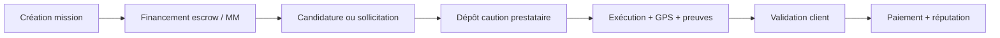

# BlockTask

Plateforme hybride de délégation de tâches physiques entre particuliers et entreprises — paiements Mobile Money, escrow blockchain, KYC et suivi GPS en temps réel.

**Marché cible (phase 1)** : Mali — FCFA, NINA, Orange Money / Moov Money, Bamako. Extension UEMOA prévue.

| Web (Angular) | Mobile (Expo) | API (Django) | Blockchain (Solidity) |
|:---:|:---:|:---:|:---:|
| Client · Prestataire · Entreprise · Admin | iOS & Android | REST + WebSockets | Escrow · Réputation · Litiges |

---

## Sommaire

- [Architecture](#architecture)
- [Fonctionnalités](#fonctionnalités)
- [Démarrage rapide](#démarrage-rapide)
- [Configuration](#configuration)
- [Tests](#tests)
- [Déploiement](#déploiement)
- [Technologies](#technologies)
- [Roadmap](#roadmap)

---

## Architecture

```
blocktask/
├── backend/                 # Django REST API + WebSockets
│   ├── apps/
│   │   ├── users/           # Auth JWT, KYC, rôles doubles, entreprises
│   │   ├── missions/        # Missions, candidatures, sollicitations, catégories
│   │   ├── escrow/          # Cautions, blockchain, sync événements
│   │   ├── payments/        # Mobile Money (Orange / Moov)
│   │   ├── reputation/      # Score algorithmique 0–100
│   │   ├── disputes/        # Litiges et arbitrage
│   │   ├── tracking/        # GPS temps réel (Channels)
│   │   ├── proofs/          # Photos, QR, signatures
│   │   ├── enterprises/     # Employés, affectations B2B
│   │   ├── notifications/   # Push, email, in-app
│   │   ├── analytics/       # Statistiques
│   │   └── common/          # Config marché Afrique, paramètres plateforme
│   ├── tests/               # Pytest (flux MVP, KYC, entreprise…)
│   └── manage.py
│
├── frontend/                # Angular 17 — application web
│   └── src/app/features/
│       ├── client/          # Création missions, paiements, litiges
│       ├── provider/        # Missions, caution, preuves, revenus
│       ├── enterprise/      # Employés, finances, sollicitations
│       ├── admin/           # KYC, utilisateurs, blockchain
│       └── landing/         # Page publique, annuaire prestataires
│
├── mobile/                  # React Native / Expo SDK 52
│   ├── app/                 # Écrans Expo Router (tabs + stacks)
│   └── src/api/             # Client HTTP, auth, missions, sollicitations
│
└── smart-contracts/         # Solidity ^0.8.20 (Sepolia)
    ├── EscrowContract.sol
    ├── ReputationContract.sol
    └── LitigationContract.sol
```

### Flux métier principal



---

## Fonctionnalités

### Authentification & profils

- Inscription / connexion JWT avec refresh token rotatif
- Connexion Google, réinitialisation mot de passe, vérification email
- Rôles doubles : un compte peut être **client** et **prestataire**
- KYC (NINA, pièce d'identité, selfie) avec revue admin
- Complétion de profil guidée avant accès plateforme
- Profils publics prestataires et entreprises (landing)

### Missions

- 40+ catégories avec **règles métier** (caution, exigences, valeur marchandise)
- Workflow complet : création → financement → candidature → caution → exécution → validation
- **Sollicitations** : client ou entreprise invite un prestataire spécifique
- Candidatures, assignation employé (entreprise), expiration automatique
- Aperçu caution dynamique selon catégorie et budget
- Géolocalisation et missions disponibles à proximité

### Paiements & cautions

- **Mobile Money** (Orange Money, Moov Money) — sandbox et production
- Alimentation caution via débit MM (pas de crédit manuel)
- Escrow hybride : base de données + smart contracts Ethereum
- Historique paiements, finances entreprise, revenus prestataire

### Preuves, suivi & confiance

- Upload photos / vidéos, signatures, validation QR
- Tracking GPS temps réel (WebSocket)
- Système de réputation (score, niveaux Bronze → Platine)
- Litiges avec preuves et arbitrage admin
- Évaluations post-mission

### Espaces utilisateurs

| Espace | Principales actions |
|--------|---------------------|
| **Client** | Créer missions, solliciter, payer, suivre GPS, valider, noter |
| **Prestataire** | Postuler, déposer caution, exécuter, soumettre preuves, revenus |
| **Entreprise** | Gérer employés, missions reçues, finances, sollicitations B2B |
| **Admin** | KYC, utilisateurs, litiges, blockchain, analytics, paramètres |

### Applications

| Plateforme | Stack | État |
|------------|-------|------|
| **Web** | Angular 17 + Material | MVP fonctionnel |
| **Mobile** | Expo 52 + TypeScript | MVP fonctionnel (client & prestataire) |
| **API** | Django 4.2 + DRF + Channels | MVP fonctionnel |
| **Contrats** | Solidity + Sepolia | Déployés (testnet) |

---

## Démarrage rapide

### Prérequis

- Python 3.11+
- Node.js 18+
- Redis (WebSockets, optionnel en dev)
- PostgreSQL (optionnel — SQLite par défaut)
- Expo Go (pour tester le mobile)

### 1. Backend

```bash
cd backend
python -m venv venv

# Windows
venv\Scripts\activate
# Linux / macOS
source venv/bin/activate

pip install -r requirements.txt
cp .env.example .env          # puis éditez les variables
python manage.py migrate
python manage.py createsuperuser
python manage.py runserver 0.0.0.0:8000
```

> Utilisez `0.0.0.0:8000` pour que le mobile (émulateur ou téléphone) puisse joindre l'API.

**Utilisateurs de test** (optionnel) :

```bash
python create_test_users.py
```

### 2. Frontend web

```bash
cd frontend
npm install
ng serve
```

Application disponible sur `http://localhost:4200`.

### 3. Application mobile

```bash
cd mobile
npm install
cp .env.example .env          # EXPO_PUBLIC_API_URL=http://VOTRE_IP:8000/api
npm start
```

| Environnement | URL API par défaut |
|---------------|-------------------|
| Android émulateur | `http://10.0.2.2:8000/api` |
| iOS simulateur | `http://localhost:8000/api` |
| Téléphone physique | `http://192.168.x.x:8000/api` (IP locale du PC) |

Scannez le QR code avec **Expo Go** (SDK 52) ou lancez `npm run android` / `npm run ios`.

### 4. Docker (optionnel)

```bash
docker compose up --build
```

Services : backend `8000`, frontend `4200`, PostgreSQL `5432`, Redis `6379`.

---

## Configuration

Copiez `backend/.env.example` vers `backend/.env`. Variables principales :

| Variable | Description |
|----------|-------------|
| `SECRET_KEY` | Clé secrète Django |
| `REDIS_URL` | Redis pour WebSockets |
| `ETHEREUM_RPC_URL` | RPC Sepolia (Alchemy / Infura) |
| `ESCROW_CONTRACT_ADDRESS` | Adresse contrat escrow déployé |
| `MOBILE_MONEY_SANDBOX` | `true` pour les tests sans vrai débit |
| `ORANGE_MONEY_*` / `MOOV_MONEY_*` | Identifiants opérateurs |
| `RESEND_API_KEY` / `SENDGRID_API_KEY` | Envoi d'emails |
| `FRONTEND_URL` | URL du frontend (liens email) |

Voir aussi `mobile/.env.example` pour l'URL de l'API mobile.

---

## Tests

```bash
cd backend
pytest
```

Suites disponibles :

- `test_mvp_flow.py` — parcours bout-en-bout MVP
- `test_dual_roles.py` — rôles client / prestataire
- `test_enterprise_flow.py` — flux entreprise
- `test_mission_expiry.py` — expiration missions
- `test_profile_completion.py` — complétion profil / KYC

---

## Déploiement

Le projet est configuré pour **Railway** (`railway.json`) avec collectstatic au runtime.

**Smart contracts** : voir `smart-contracts/DEPLOY_SEPOLIA.md` et `smart-contracts/README_MALI.md`.

Après déploiement des contrats :

```bash
python update_contracts.py
```

---

## Technologies

| Couche | Technologies |
|--------|-------------|
| **Backend** | Django 4.2, DRF, SimpleJWT, Channels, Web3.py, Celery, Redis |
| **Frontend** | Angular 17, Angular Material, RxJS, Leaflet, Chart.js |
| **Mobile** | Expo 52, React Native, Expo Router, TypeScript |
| **Blockchain** | Solidity ^0.8.20, OpenZeppelin, Sepolia testnet |
| **Paiements** | Orange Money, Moov Money (API REST) |
| **Base de données** | PostgreSQL + PostGIS (prod), SQLite (dev) |

---

## Roadmap

### En cours / à renforcer

- [ ] Notifications push Firebase (mobile)
- [ ] Tâches Celery planifiées en production
- [ ] Tests E2E Cypress (web)
- [ ] Audit sécurité smart contracts
- [ ] Extension marchés UEMOA (Sénégal, Côte d'Ivoire…)

### Réalisé (MVP)

- [x] Auth JWT, Google, reset password, vérification email
- [x] KYC avec revue admin et blocage plateforme
- [x] Missions, candidatures, sollicitations, catégories avec règles
- [x] Cautions via Mobile Money
- [x] GPS temps réel (WebSocket)
- [x] Preuves (photo, QR, signature)
- [x] Litiges et réputation
- [x] Espaces client, prestataire, entreprise, admin (web)
- [x] Application mobile Expo (client & prestataire)
- [x] Intégration blockchain Sepolia
- [x] Tests pytest flux métier

---

## Licence

MIT License — voir le fichier [LICENSE](LICENSE) pour plus de détails.

---

> **Note** : Projet à visée éducative et prototype. Un audit de sécurité complet est requis avant toute mise en production.
