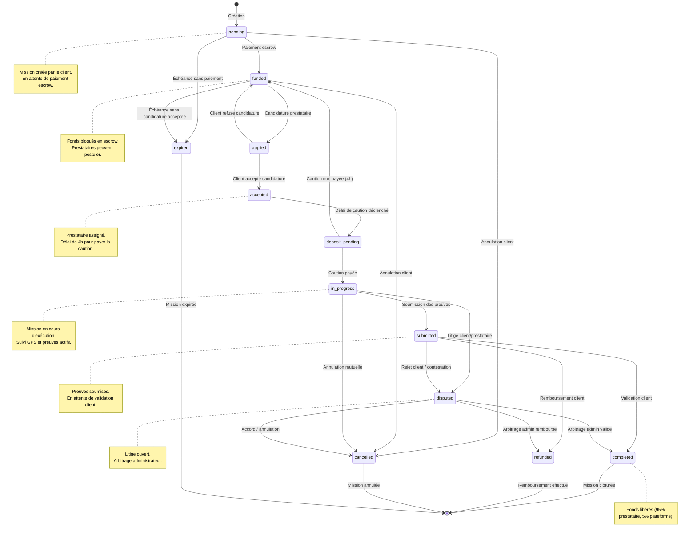

# Diagramme d'états — Cycle de vie d'une mission BlockTask

## Légende

- **pending** : Mission créée, en attente de paiement.
- **funded** : Paiement escrow confirmé, mission ouverte aux candidatures.
- **applied** : Au moins une candidature en attente de décision.
- **accepted** : Prestataire choisi par le client.
- **deposit_pending** : Délai de 4 heures pour payer la caution.
- **in_progress** : Mission démarrée et en cours d'exécution.
- **submitted** : Preuves soumises par le prestataire.
- **completed** : Mission validée et payée.
- **disputed** : Litige en cours d'arbitrage.
- **cancelled** : Mission annulée par l'une ou l'autre des parties.
- **expired** : Mission non exécutée dans les délais.
- **refunded** : Fonds remboursés au client.
