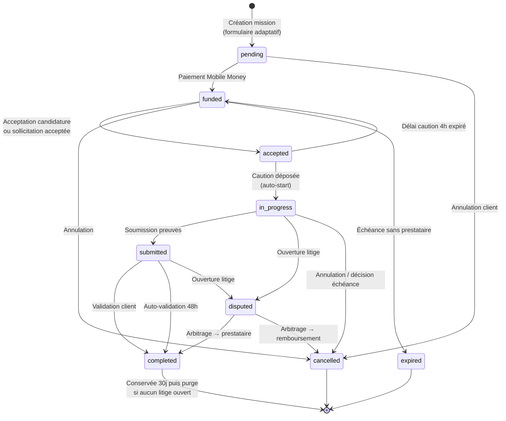

# Diagramme d'états — Cycle de vie d'une mission BlockTask

> Source Mermaid synchronisée : `mermaid/06-etats-mission.mmd`

```mermaid
stateDiagram-v2
    [*] --> pending : Création mission<br/>(formulaire adaptatif)

    pending --> funded : Paiement Mobile Money
    pending --> cancelled : Annulation client

    funded --> accepted : Acceptation candidature<br/>ou sollicitation acceptée
    funded --> cancelled : Annulation
    funded --> expired : Échéance sans prestataire

    accepted --> in_progress : Caution déposée<br/>(auto-start)
    accepted --> funded : Délai caution 4h expiré

    in_progress --> submitted : Soumission preuves
    in_progress --> disputed : Ouverture litige
    in_progress --> cancelled : Annulation / décision échéance

    submitted --> completed : Validation client
    submitted --> completed : Auto-validation 48h
    submitted --> disputed : Ouverture litige

    disputed --> completed : Arbitrage → prestataire
    disputed --> cancelled : Arbitrage → remboursement

    completed --> [*] : Conservée 30j puis purge<br/>si aucun litige ouvert
    cancelled --> [*]
    expired --> [*]
```

## Légende

| État | Signification |
|------|----------------|
| **pending** | Mission créée, champs adaptés à la catégorie, en attente de paiement |
| **funded** | Escrow FCFA bloqué ; candidatures ou sollicitations |
| **accepted** | Prestataire choisi ; délai caution 4 h |
| **in_progress** | Caution OK → démarrage automatique ; GPS / chat / preuves |
| **submitted** | Preuves déposées ; validation client ou auto 48 h |
| **completed** | Paiement 95/5 ; compte à rebours arrêté ; purge après 30 j sans litige ouvert |
| **disputed** | Litige ouvert |
| **cancelled** / **expired** | Fin sans exécution complète |
